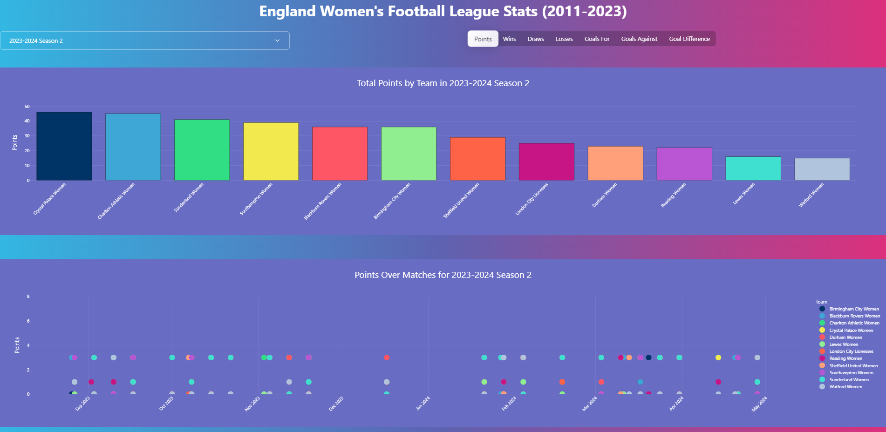

# Women Football Dashboard

Plotly Dash application that provides statistics for the England Women's Football League from 2011 to 2023.

## Installation

To run this application, please follow these steps:

1. Clone the repository to your local machine.
2. Install the required dependencies by running `pip install -r requirements.txt`.
3. Run the application by executing the `app.py` file.

## Usage

Once the application is running, you can access the dashboard by opening your web browser and navigating to `http://localhost:8050`.

The dashboard provides the following features:

- Season selection: Choose a specific season to view team statistics.
- Metric tabs: Switch between different metrics to analyze team performance.
- Team statistics bar chart: Visualize the total metric value for each team in the selected season.
- Team statistics scatter chart: Explore the metric value over matches for each team in the selected season.
